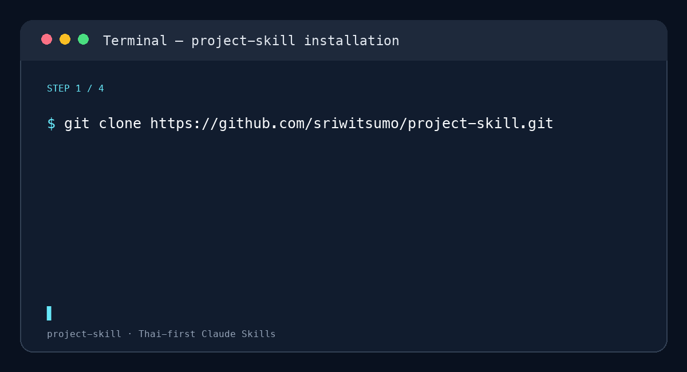

# Claude Skill เขียนโครงงานภาษาไทย — project-skill

[](LICENSE)
[](CONTRIBUTING.md)
[](https://github.com/sriwitsumo/project-skill/actions/workflows/validate.yml)
[](https://github.com/sriwitsumo/project-skill/issues)

> ชุด Agent Skills ภาษาไทยสำหรับ Claude, ChatGPT Work และ Codex — งานวิชาการ หนังสือราชการ และโครงงานวิจัย

**Claude Skill เขียนโครงงานภาษาไทย** ชุดนี้ช่วยจัดกระบวนการตั้งแต่เก็บโจทย์ก่อนเขียน ร่างบทที่ 1–3 ตรวจรายการอ้างอิง APA ไปจนถึงจัดเอกสาร Word โดยแยกเป็น 7 สกิลที่เลือกใช้ตามขั้นตอนงานได้

ออกแบบเพื่อผู้เรียน ผู้สอน และผู้ทำงานภาษาไทยโดยเฉพาะ — ตั้งแต่เก็บโจทย์โครงงาน เขียนบทที่ 1–3 จัดรายการอ้างอิง ไปจนถึงจัดบรรทัด Word ให้สวยและถูกต้อง

เริ่มอ่าน: [คู่มือ Claude Skill เขียนโครงงานภาษาไทยใน GitHub](GUIDE_TH.md) · [คู่มือออนไลน์](https://project-skill-site.vercel.app/claude-skill-thai-project.html) · [วิธีติดตั้ง](https://project-skill-site.vercel.app/installation.html) · สำหรับผู้ดูแลเว็บไซต์: [project-skill-site (private)](https://github.com/sriwitsumo/project-skill-site)

## จุดเด่น

- **ออกแบบเพื่อภาษาไทย:** ใช้รูปแบบภาษาไทย งานวิชาการ และบริบทการศึกษาไทยเป็นแกนหลัก
- **ใช้ได้จริง:** ครอบคลุมตั้งแต่รวบรวมโจทย์โครงงาน ไปจนถึงบทที่ 1–3 และรายการอ้างอิง
- **รับผิดชอบต่อผู้ใช้:** เน้นการตรวจสอบแหล่งข้อมูล ความถูกต้อง และความเป็นเจ้าของงาน
- **พัฒนาร่วมกันได้:** เปิดรับข้อเสนอ การแก้ไข และสกิลใหม่จากชุมชน

## ใช้ได้กับ Claude Free, Claude Code, ChatGPT Work และ Codex

- **Claude Free / Pro / Max (chat, web, desktop, mobile):** อัปโหลดสกิลเป็น ZIP ที่ `Customize → Skills` หลังเปิด `Code execution and file creation`
- **Claude Code:** เพิ่ม marketplace นี้ แล้วติดตั้ง plugin `project-skill` ด้วยสองคำสั่งด้านล่าง
- **ChatGPT Work (รวมถึง ChatGPT chat ที่ติดตั้ง plugin):** รีโปนี้เป็น plugin ที่มี manifest และ 7 สกิลพร้อมติดตั้ง
- **Codex:** ติดตั้งจากโฟลเดอร์ `skills/` บนเครื่องหรือในรีโปของคุณ

ดูคู่มือแยกตามแพลตฟอร์มที่ [เว็บไซต์คู่มือ](https://project-skill-site.vercel.app/installation.html)

## เริ่มต้นใน 30 วินาที — Claude Code

```bash
claude plugin marketplace add sriwitsumo/project-skill
claude plugin install project-skill@sriwit-thai-skills
```

จากนั้นเปิด Claude Code แล้วลอง: `ช่วยเริ่มเก็บข้อมูลสำหรับโครงงานของฉัน`

หากเคยเพิ่ม marketplace แล้ว ให้ข้ามบรรทัดแรกได้ และเมื่อมีเวอร์ชันใหม่ให้ใช้ `claude plugin marketplace update sriwit-thai-skills`

<p align="center">
  
</p>

## เหมาะกับใคร

| คุณต้องการ… | เริ่มที่สกิล |
| --- | --- |
| รวบรวมข้อมูลก่อนเขียนโครงงาน | `thai-project-intake` |
| เขียนบทที่ 1: ที่มา วัตถุประสงค์ สมมติฐาน และขอบเขต | `thai-project-chapter1` |
| สังเคราะห์เอกสารและงานวิจัยที่เกี่ยวข้อง | `thai-project-chapter2` |
| วางวิธีดำเนินการวิจัย | `thai-project-chapter3` |
| จัดรายการอ้างอิงแบบ APA ภาษาไทย | `thai-project-references` |
| ร่างหนังสือราชการหรือปรับภาษาเชิงวิชาการ | `thai-official-academic-writing` |
| จัดบรรทัดเอกสาร Word ภาษาไทย | `thai-word-line-fit` |

---

## สกิลในรีโปนี้

### 1. `thai-official-academic-writing`

**ไทย:** ร่าง ปรับแก้ และตรวจคุณภาพหนังสือราชการไทย ข้อเสนอโครงงาน งานเขียนเชิงวิจัย และรายการอ้างอิงแบบ APA 7 ครอบคลุมการจัดตัวอักษรและเลย์เอาต์เอกสารภาษาไทย ใช้กับหนังสือราชการ โครงงาน รายงาน วิทยานิพนธ์ หรือบทความวิชาการ และจะยึดตามเทมเพลตของสถาบันเมื่อผู้ใช้ให้มา

**EN:** Draft, revise, and quality-check Thai official correspondence, project proposals, research writing, and APA 7 references, including Thai typography and document layout. Use for หนังสือราชการ, โครงงาน, reports, theses, or academic manuscripts; defers to an institution's required template when supplied.

---

### 2. `thai-project-references`

**ไทย:** จัดทำหัวข้อ "รายการอ้างอิง" / "เอกสารอ้างอิง" / "บรรณานุกรม" ท้ายเล่มโครงงานหรืองานวิจัยภาษาไทยระดับมัธยมปลายถึงอุดมศึกษา โดยรวบรวมแหล่งอ้างอิงทั้งหมดที่ใช้ในบทที่ 1–3 มาจัดรูปแบบตามหลัก APA แบบไทย เรียงลำดับตัวอักษรถูกต้อง และตรวจสอบว่าการอ้างอิงในเนื้อหาทุกจุดมีรายการตรงกันครบ 1:1

**EN:** Builds the end-of-document reference list (รายการอ้างอิง / เอกสารอ้างอิง / บรรณานุกรม) for Thai high-school-to-university projects. Formats every source in Thai-style APA, sorts correctly (Thai block first, English block second), and verifies a strict 1:1 match between in-text citations and list entries.

---

### 3. `thai-word-line-fit`

**ไทย:** จัดหรือแก้เอกสาร Microsoft Word ภาษาไทยให้ฟอนต์ TH Sarabun New ขนาด 16 ตัดบรรทัดสวยตามธรรมชาติ โดยไม่ยืดช่องว่างระหว่างคำ รักษาย่อหน้าเดิม และไม่กด Enter กลางย่อหน้า

**EN:** Fixes Thai line breaking in Microsoft Word documents set in TH Sarabun New 16, so lines wrap naturally without stretched word spacing. Preserves real paragraph structure and never inserts hard returns mid-paragraph.

---

### 4. `thai-project-chapter1`

**ไทย:** เขียนบทที่ 1 ของโครงงานวิจัยภาษาไทยระดับมัธยมปลายถึงอุดมศึกษา ครอบคลุมที่มาและความสำคัญของปัญหา วัตถุประสงค์ สมมติฐาน ขอบเขต นิยามศัพท์ และประโยชน์ที่คาดว่าจะได้รับ โดยใช้ภาษาวิชาการไทยที่ถูกต้องตามรูปแบบของสถาบัน

**EN:** Writes Chapter 1 of Thai research projects (high school to university level), covering background and significance, objectives, hypotheses, scope, term definitions, and expected benefits. Uses formal Thai academic language following the institution's required format.

---

### 5. `thai-project-chapter2`

**ไทย:** เขียนบทที่ 2 ของโครงงานวิจัยภาษาไทย (เอกสารและงานวิจัยที่เกี่ยวข้อง) โดยค้นหาแหล่งอ้างอิงที่เชื่อถือได้ สังเคราะห์กรอบแนวคิด และอ้างอิงแบบ APA ภาษาไทย ใช้ได้กับโครงงานทุกสาขา

**EN:** Writes Chapter 2 of Thai research projects (related documents and research). Searches for credible sources, synthesizes a conceptual framework, and cites in Thai APA style. Works across all subject areas.

---

### 6. `thai-project-chapter3`

**ไทย:** เขียนบทที่ 3 ของโครงงานวิจัยภาษาไทย (วิธีดำเนินการวิจัย) ครอบคลุมรูปแบบการวิจัย ประชากรและกลุ่มตัวอย่าง เครื่องมือ การเก็บรวบรวมข้อมูล และการวิเคราะห์ข้อมูล

**EN:** Writes Chapter 3 of Thai research projects (research methodology), covering research design, population and sampling, instruments, data collection, and data analysis procedures.

---

### 7. `thai-project-intake`

**ไทย:** รวบรวมข้อมูลโครงงานจากผู้ใช้ก่อนส่งต่อให้สกิลเขียนบทที่ 1–3 โดยถามข้อมูลสำคัญของโครงงานอย่างเป็นระบบ เช่น หัวข้อ วัตถุประสงค์ กลุ่มตัวอย่าง และเครื่องมือ

**EN:** Intake skill — collects project information from the user before handing off to Chapter 1–3 writing skills. Systematically gathers key project details such as topic, objectives, sample group, and instruments.

---

## ความเข้ากันได้

ทุกสกิลเป็นไฟล์ Markdown ตามมาตรฐาน Agent Skills (`SKILL.md` พร้อม `reference/` และ `agents/` เมื่อจำเป็น) รีโปนี้มี plugin manifest เพื่อใช้กับ ChatGPT Work ด้วย

| Platform | ใช้ได้ | วิธี |
|---|---|---|
| **Claude Free / Pro / Max** | ✅ | เปิด Code execution แล้วอัปโหลด ZIP ที่ `Customize → Skills` |
| **Claude chat** (web, desktop, mobile) | ✅ | ใช้สกิลที่เปิดไว้ใน `Customize → Skills` |
| **Claude Code** | ✅ | ติดตั้งผ่าน Claude Plugin Marketplace หรือใช้โฟลเดอร์ใน `skills/` |
| **Claude Cowork** | ✅ | ใช้โฟลเดอร์ใน `skills/` ตาม workspace ที่เปิดใช้งาน |
| **ChatGPT Work** | ✅ | ติดตั้ง plugin `project-skill` ซึ่งรวม 7 สกิล |
| **ChatGPT chat** | ✅ | ใช้ plugin เดียวกันหลังติดตั้งใน ChatGPT |
| Gemini / Copilot / Perplexity | ไม่ได้ทดสอบ | ไม่มีคู่มือติดตั้งสำหรับโปรเจกต์นี้ |

**Claude model:** ทุก version ที่รองรับ Claude Skills (Haiku, Sonnet, Opus) — สกิลที่ใช้ WebSearch (`chapter2`, `references`) แนะนำ Sonnet ขึ้นไป

**ระบบปฏิบัติการ:** macOS 12+, Ubuntu 20.04+, Debian 11+, Windows 10/11 (via WSL2)

---

## ⚠️ ข้อควรระวัง

> ผลลัพธ์ที่ได้จากทุกสกิลในชุดนี้เป็น **ตัวอย่างและจุดเริ่มต้นเท่านั้น**

- **ไม่ควรนำส่งตรง ๆ** โดยไม่อ่านและแก้ไขก่อน — เนื้อหาที่ AI สร้างอาจมีข้อผิดพลาด ข้อมูลคลาดเคลื่อน หรือไม่ตรงกับบริบทจริง
- **อ่านทบทวนทุกประโยค** ก่อนใช้งาน แก้ไขส่วนที่ผิดหรือไม่ตรงกับโครงงาน/งานของคุณ
- **เขียนใหม่ด้วยสำนวนของตัวเอง** — งานวิชาการควรสะท้อนความเข้าใจและเสียงของผู้เขียน ไม่ใช่ AI
- ตรวจสอบว่าเนื้อหาตรงตาม **รูปแบบและข้อกำหนดของสถาบัน/อาจารย์** ของคุณ

---

## ร่วมพัฒนา

ยินดีต้อนรับทุก contribution — ตั้งแต่การแก้คำอธิบาย เพิ่มตัวอย่าง ไปจนถึงสกิลใหม่ โปรดอ่าน [CONTRIBUTING.md](CONTRIBUTING.md) ก่อนเปิด pull request และใช้ [Issues](https://github.com/sriwitsumo/project-skill/issues) สำหรับ bug/feature requests หรือ [Discussions](https://github.com/sriwitsumo/project-skill/discussions) สำหรับคำถามและไอเดีย

## ใบอนุญาต

เผยแพร่ภายใต้ [MIT License](LICENSE) © 2026 Sriwit Rujirawatanakul

## การอ้างอิง

หากนำไปใช้ในผลงานวิชาการ โปรดอ้างอิงโปรเจกต์ตามข้อมูลใน [CITATION.cff](CITATION.cff)

## ค้นหาโปรเจกต์นี้

คำค้นที่เกี่ยวข้อง: **Thai academic writing, Claude Skills, Thai research project, APA 7 Thai, official correspondence, Thai Word typography, โครงงานวิจัย, หนังสือราชการ, บทที่ 1–3, รายการอ้างอิง**

ถ้าชุดสกิลนี้ช่วยคุณได้ **ช่วยกด ⭐ Star ให้หน่อยนะครับ** — หนึ่งดาวของคุณช่วยให้ผู้เรียนและผู้สอนภาษาไทยค้นพบโปรเจกต์นี้มากขึ้นจริง ๆ

คุณยังช่วยได้ด้วยการแชร์ตัวอย่างการใช้งานที่ตรวจสอบแล้ว หรือเสนอไอเดียใน [Discussions](https://github.com/sriwitsumo/project-skill/discussions)

---

## การติดตั้ง

### เลือกวิธีให้ตรงกับแอปที่ใช้

1. **Claude Code:** เพิ่ม Claude Plugin Marketplace แล้วติดตั้งทั้งชุดด้วย 2 คำสั่ง
2. **Claude Free / Pro / Max:** ไม่ต้องติดตั้ง Terminal — ดาวน์โหลดหรือ clone รีโป แล้ว ZIP โฟลเดอร์สกิลที่ต้องการเพื่ออัปโหลดใน Claude chat
3. **ChatGPT Work / ChatGPT chat:** ใช้ plugin ในรีโปนี้ ซึ่งรวมสกิลทั้งหมดไว้ใต้ `skills/`
4. **Codex:** ใช้คำสั่ง Terminal ด้านล่าง

> ใช้ใน Claude Free ได้: ไปที่ `Settings → Capabilities` เปิด **Code execution and file creation** จากนั้น `Customize → Skills → + Create skill → Upload a skill` แล้วเลือก ZIP ที่มีโฟลเดอร์สกิลและ `SKILL.md` อยู่ข้างใน

---

### วิธีที่ 0 — Claude Code Marketplace *(แนะนำสำหรับ Claude Code)*

วิธีนี้ไม่ต้อง clone หรือคัดลอกโฟลเดอร์เอง และเป็นเส้นทางที่ทำให้ plugin นี้ปรากฏในหน้า Discover หลังเพิ่ม marketplace แล้ว

```bash
# เพิ่ม catalog ของ project-skill ครั้งเดียว
claude plugin marketplace add sriwitsumo/project-skill

# ติดตั้งทั้งชุด 7 skills
claude plugin install project-skill@sriwit-thai-skills
```

ตรวจสอบด้วย `claude plugin list` แล้วเริ่ม task ใหม่ได้ทันที สกิลจะเรียกโดยอัตโนมัติเมื่อโจทย์ตรงกับคำอธิบาย หรือเรียกโดยตรงด้วยชื่อ `project-skill:thai-project-intake`

---

### วิธีที่ 1 — ติดตั้งแบบ Global

ใช้ได้กับทุก project บนเครื่อง สกิลพร้อมใช้งานทันทีในทุก session หากไม่ต้องการใช้ Claude Plugin Marketplace

```bash
# 1. Clone repo รวม
git clone https://github.com/sriwitsumo/project-skill.git
cd project-skill

# 2. สร้างโฟลเดอร์ skills (ถ้ายังไม่มี)
mkdir -p ~/.claude/skills

# 3. ติดตั้งสกิลที่ต้องการ (หรือติดตั้งทั้งหมดพร้อมกัน)
cp -R skills/thai-official-academic-writing ~/.claude/skills/
cp -R skills/thai-project-references        ~/.claude/skills/
cp -R skills/thai-word-line-fit             ~/.claude/skills/
cp -R skills/thai-project-intake            ~/.claude/skills/
cp -R skills/thai-project-chapter1          ~/.claude/skills/
cp -R skills/thai-project-chapter2          ~/.claude/skills/
cp -R skills/thai-project-chapter3          ~/.claude/skills/

# 4. ตรวจสอบ
ls ~/.claude/skills/
```

---

### วิธีที่ 2 — ติดตั้งแบบ Project-local

ใช้เฉพาะใน project ที่ต้องการ ไม่กระทบ project อื่น

```bash
# ภายในโฟลเดอร์ project ของคุณ
mkdir -p .claude/skills
cp -R skills/thai-project-chapter1 .claude/skills/
# เพิ่มสกิลอื่น ๆ ได้ตามต้องการ
```

---

### วิธีที่ 3 — Claude Free / Claude chat

1. ดาวน์โหลด repo เป็น ZIP จาก GitHub แล้วแตกไฟล์
2. เปิดโฟลเดอร์ `skills/` และบีบอัด **ทีละโฟลเดอร์** ที่จะใช้ เช่น `thai-project-chapter1/` เป็น `thai-project-chapter1.zip`
3. ใน Claude: `Customize → Skills → + Create skill → Upload a skill`
4. เลือก ZIP แล้วเปิดใช้งานสกิลนั้นในรายการ Skills

หากใช้ Terminal ให้สร้าง ZIP ทั้ง 7 สกิลพร้อมกันด้วย `bash scripts/package-claude-skills.sh` แล้วเลือกไฟล์จาก `dist/claude-skills/`

### วิธีที่ 4 — ChatGPT Work / ChatGPT chat

รีโปนี้จัดเป็น plugin แล้ว: `.codex-plugin/plugin.json` อ้างถึง `skills/` ทั้ง 7 สกิล สร้าง plugin archive ด้วย `bash scripts/package-plugin.sh` แล้วเพิ่ม `dist/project-skill-plugin.zip` ผ่านหน้า Customize/Plugins ของ ChatGPT Work ตามสิทธิ์ของ workspace จากนั้นเปิด plugin `project-skill` ก่อนเริ่มแชตใหม่

### Claude Cowork

วางโฟลเดอร์สกิลที่ต้องการไว้ใน skills directory ของ Cowork workspace แล้ว reload workspace

---

### ตรวจสอบว่าสกิลทำงาน / Verify

เปิด Claude แล้วลองพูดถึงงานที่สกิลนั้นครอบคลุม เช่น:

> "ช่วยเขียนบทที่ 1 โครงงานให้หน่อย"

ถ้าสกิลทำงาน: Claude จะถามข้อมูลโครงงานก่อน แทนที่จะตอบแบบทั่วไปทันที

---

### อัปเดตสกิล / Update

```bash
cd project-skill
git pull
cp -R skills/thai-project-chapter1 ~/.claude/skills/
# ทำซ้ำสำหรับสกิลอื่น ๆ ที่ติดตั้งไว้
```

---

### การเรียกใช้งาน / Invocation

**ไทย:** สกิลจะทำงานอัตโนมัติเมื่อ Claude เห็นว่าคำขอของคุณตรงกับคำอธิบายของสกิลนั้น ไม่ต้องเรียกด้วยชื่อ (แต่จะเรียกชื่อตรง ๆ ก็ได้)

**EN:** Skills trigger automatically when Claude judges your request to match a skill's description — no need to invoke them by name, though you can.

---

## โครงสร้าง / Repository layout

```
project-skill/
├── README.md
├── .gitignore
├── .claude-plugin/
│   ├── marketplace.json
│   └── plugin.json
├── .codex-plugin/
│   └── plugin.json
├── skills/
│   ├── thai-official-academic-writing/
│   └── SKILL.md
├── skills/thai-project-references/
│   └── SKILL.md
├── skills/thai-word-line-fit/
│   └── SKILL.md
├── skills/thai-project-intake/
│   └── SKILL.md
├── skills/thai-project-chapter1/
│   ├── SKILL.md
│   ├── README.md
│   └── reference/
│       ├── 01-thima-khwamsamkhan.md
│       ├── 02-watthuprasong.md
│       ├── 03-sommutithan.md
│       ├── 04-khobkhet.md
│       ├── 05-prayotchn.md
│       ├── 06-niyamsap.md
│       ├── 07-phasa-wichakan.md
│       ├── 08-pongkan-wangwon.md
│       └── 09-tuapae.md
├── skills/thai-project-chapter2/
│   ├── SKILL.md
│   ├── README.md
│   ├── agents/
│   │   └── openai.yaml
│   └── reference/
│       ├── 01-structure-by-project-type.md
│       ├── 02-search-and-source-validation.md
│       ├── 03-citation-style.md
│       ├── 04-synthesis-and-framework.md
│       └── 05-content-ownership-and-quality.md
├── skills/thai-project-chapter3/
│   ├── SKILL.md
│   └── README.md
└── skills/thai-project-intake/
    ├── SKILL.md
    └── README.md
```

---

GitHub: [sriwitsumo](https://github.com/sriwitsumo)
