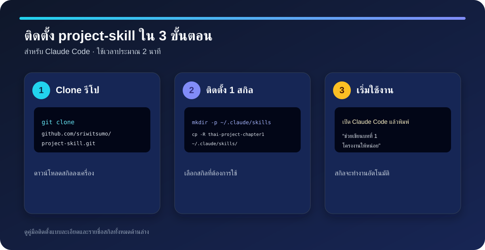

# project-skill

[](LICENSE)
[](CONTRIBUTING.md)
[](https://github.com/sriwitsumo/project-skill/issues)

> Thai-first Claude Skills for academic writing, research projects, official correspondence, and Word document typography.

ชุด Claude Skills สำหรับงานเขียนภาษาไทยเชิงวิชาการ งานเอกสารราชการ และโครงงานวิจัย  
A collection of Claude Skills for Thai academic writing, official correspondence, research projects, and Word document typography.

## จุดเด่น / Why project-skill

- **Thai-first:** ออกแบบสำหรับรูปแบบภาษาไทย งานวิชาการ และบริบทการศึกษาไทย
- **Practical:** ใช้ได้ตั้งแต่รวบรวมโจทย์โครงงาน ไปจนถึงบทที่ 1–3 และรายการอ้างอิง
- **Responsible by default:** เน้นการตรวจสอบแหล่งข้อมูล ความถูกต้อง และความเป็นเจ้าของงาน
- **Open to improve:** รับข้อเสนอ แก้ไข และสกิลใหม่จากชุมชน

## เริ่มต้นใน 2 นาที / Quick start

```bash
git clone https://github.com/sriwitsumo/project-skill.git
mkdir -p ~/.claude/skills
cp -R project-skill/thai-project-chapter1 ~/.claude/skills/
```

จากนั้นเปิด Claude Code แล้วลอง: `ช่วยเขียนบทที่ 1 โครงงานให้หน่อย`



## เหมาะกับใคร / Use cases

| คุณต้องการ… | เริ่มที่สกิล |
| --- | --- |
| รวบรวมข้อมูลก่อนเขียนโครงงาน | `thai-project-intake` |
| เขียนบทที่ 1: ที่มา วัตถุประสงค์ สมมติฐาน และขอบเขต | `thai-project-chapter1` |
| สังเคราะห์เอกสารและงานวิจัยที่เกี่ยวข้อง | `thai-project-chapter2` |
| วางวิธีดำเนินการวิจัย | `thai-project-chapter3` |
| จัดรายการอ้างอิงแบบ APA ภาษาไทย | `thai-project-references` |
| ร่างหนังสือราชการหรือปรับภาษาเชิงวิชาการ | `thai-official-academic-writing` |
| จัดบรรทัดเอกสาร Word ภาษาไทย | `thai-word-line-fit` |

---

## สกิลในรีโปนี้ / Skills in this repo

### 1. `thai-official-academic-writing`

**ไทย:** ร่าง ปรับแก้ และตรวจคุณภาพหนังสือราชการไทย ข้อเสนอโครงงาน งานเขียนเชิงวิจัย และรายการอ้างอิงแบบ APA 7 ครอบคลุมการจัดตัวอักษรและเลย์เอาต์เอกสารภาษาไทย ใช้กับหนังสือราชการ โครงงาน รายงาน วิทยานิพนธ์ หรือบทความวิชาการ และจะยึดตามเทมเพลตของสถาบันเมื่อผู้ใช้ให้มา

**EN:** Draft, revise, and quality-check Thai official correspondence, project proposals, research writing, and APA 7 references, including Thai typography and document layout. Use for หนังสือราชการ, โครงงาน, reports, theses, or academic manuscripts; defers to an institution's required template when supplied.

---

### 2. `thai-project-references`

**ไทย:** จัดทำหัวข้อ "รายการอ้างอิง" / "เอกสารอ้างอิง" / "บรรณานุกรม" ท้ายเล่มโครงงานหรืองานวิจัยภาษาไทยระดับมัธยมปลายถึงอุดมศึกษา โดยรวบรวมแหล่งอ้างอิงทั้งหมดที่ใช้ในบทที่ 1–3 มาจัดรูปแบบตามหลัก APA แบบไทย เรียงลำดับตัวอักษรถูกต้อง และตรวจสอบว่าการอ้างอิงในเนื้อหาทุกจุดมีรายการตรงกันครบ 1:1

**EN:** Builds the end-of-document reference list (รายการอ้างอิง / เอกสารอ้างอิง / บรรณานุกรม) for Thai high-school-to-university projects. Formats every source in Thai-style APA, sorts correctly (Thai block first, English block second), and verifies a strict 1:1 match between in-text citations and list entries.

---

### 3. `thai-word-line-fit`

**ไทย:** จัดหรือแก้เอกสาร Microsoft Word ภาษาไทยให้ฟอนต์ TH Sarabun New ขนาด 16 ตัดบรรทัดสวยตามธรรมชาติ โดยไม่ยืดช่องว่างระหว่างคำ รักษาย่อหน้าเดิม และไม่กด Enter กลางย่อหน้า

**EN:** Fixes Thai line breaking in Microsoft Word documents set in TH Sarabun New 16, so lines wrap naturally without stretched word spacing. Preserves real paragraph structure and never inserts hard returns mid-paragraph.

---

### 4. `thai-project-chapter1`

**ไทย:** เขียนบทที่ 1 ของโครงงานวิจัยภาษาไทยระดับมัธยมปลายถึงอุดมศึกษา ครอบคลุมที่มาและความสำคัญของปัญหา วัตถุประสงค์ สมมติฐาน ขอบเขต นิยามศัพท์ และประโยชน์ที่คาดว่าจะได้รับ โดยใช้ภาษาวิชาการไทยที่ถูกต้องตามรูปแบบของสถาบัน

**EN:** Writes Chapter 1 of Thai research projects (high school to university level), covering background and significance, objectives, hypotheses, scope, term definitions, and expected benefits. Uses formal Thai academic language following the institution's required format.

---

### 5. `thai-project-chapter2`

**ไทย:** เขียนบทที่ 2 ของโครงงานวิจัยภาษาไทย (เอกสารและงานวิจัยที่เกี่ยวข้อง) โดยค้นหาแหล่งอ้างอิงที่เชื่อถือได้ สังเคราะห์กรอบแนวคิด และอ้างอิงแบบ APA ภาษาไทย ใช้ได้กับโครงงานทุกสาขา

**EN:** Writes Chapter 2 of Thai research projects (related documents and research). Searches for credible sources, synthesizes a conceptual framework, and cites in Thai APA style. Works across all subject areas.

---

### 6. `thai-project-chapter3`

**ไทย:** เขียนบทที่ 3 ของโครงงานวิจัยภาษาไทย (วิธีดำเนินการวิจัย) ครอบคลุมรูปแบบการวิจัย ประชากรและกลุ่มตัวอย่าง เครื่องมือ การเก็บรวบรวมข้อมูล และการวิเคราะห์ข้อมูล

**EN:** Writes Chapter 3 of Thai research projects (research methodology), covering research design, population and sampling, instruments, data collection, and data analysis procedures.

---

### 7. `thai-project-intake`

**ไทย:** รวบรวมข้อมูลโครงงานจากผู้ใช้ก่อนส่งต่อให้สกิลเขียนบทที่ 1–3 โดยถามข้อมูลสำคัญของโครงงานอย่างเป็นระบบ เช่น หัวข้อ วัตถุประสงค์ กลุ่มตัวอย่าง และเครื่องมือ

**EN:** Intake skill — collects project information from the user before handing off to Chapter 1–3 writing skills. Systematically gathers key project details such as topic, objectives, sample group, and instruments.

---

## ความเข้ากันได้ / Compatibility

ทุกสกิลเป็นไฟล์ Markdown ตามมาตรฐาน Claude Skill (`SKILL.md` ± `reference/` ± `agents/`) ใช้ได้กับทุก platform ที่รองรับรูปแบบนี้

| Platform | รองรับ SKILL.md | หมายเหตุ |
|---|---|---|
| **Claude Code** (CLI) | ✅ | macOS · Linux · Windows (WSL2) |
| **Claude Desktop App** (Code tab) | ✅ | macOS · Windows |
| **Claude Cowork** | ✅ | วางในโฟลเดอร์ skills ของ workspace |
| Claude mobile (iOS/Android) | ❌ | chat interface เท่านั้น ไม่มีระบบ skill |
| ChatGPT / GPT-4o (OpenAI) | ❌ | ใช้รูปแบบ Custom GPT ของตัวเอง |
| Gemini (Google) | ❌ | ใช้รูปแบบ Gem ของตัวเอง |
| Microsoft Copilot | ❌ | ไม่รองรับ SKILL.md |
| Perplexity / อื่น ๆ | ❌ | ไม่รองรับ SKILL.md |

**Claude model:** ทุก version ที่รองรับ Claude Skills (Haiku, Sonnet, Opus) — สกิลที่ใช้ WebSearch (`chapter2`, `references`) แนะนำ Sonnet ขึ้นไป

**ระบบปฏิบัติการ:** macOS 12+, Ubuntu 20.04+, Debian 11+, Windows 10/11 (via WSL2)

---

## ⚠️ ข้อควรระวัง

> ผลลัพธ์ที่ได้จากทุกสกิลในชุดนี้เป็น **ตัวอย่างและจุดเริ่มต้นเท่านั้น**

- **ไม่ควรนำส่งตรง ๆ** โดยไม่อ่านและแก้ไขก่อน — เนื้อหาที่ AI สร้างอาจมีข้อผิดพลาด ข้อมูลคลาดเคลื่อน หรือไม่ตรงกับบริบทจริง
- **อ่านทบทวนทุกประโยค** ก่อนใช้งาน แก้ไขส่วนที่ผิดหรือไม่ตรงกับโครงงาน/งานของคุณ
- **เขียนใหม่ด้วยสำนวนของตัวเอง** — งานวิชาการควรสะท้อนความเข้าใจและเสียงของผู้เขียน ไม่ใช่ AI
- ตรวจสอบว่าเนื้อหาตรงตาม **รูปแบบและข้อกำหนดของสถาบัน/อาจารย์** ของคุณ

---

## ร่วมพัฒนา / Contributing

ยินดีต้อนรับทุก contribution — ตั้งแต่การแก้คำอธิบาย เพิ่มตัวอย่าง ไปจนถึงสกิลใหม่ โปรดอ่าน [CONTRIBUTING.md](CONTRIBUTING.md) ก่อนเปิด pull request และใช้ [Issues](https://github.com/sriwitsumo/project-skill/issues) สำหรับ bug/feature requests หรือ [Discussions](https://github.com/sriwitsumo/project-skill/discussions) สำหรับคำถามและไอเดีย

## License

เผยแพร่ภายใต้ [MIT License](LICENSE) © 2026 Sriwit Rujirawatanakul

## Citation

หากนำไปใช้ในผลงานวิชาการ โปรดอ้างอิงโปรเจกต์ตามข้อมูลใน [CITATION.cff](CITATION.cff)

## ค้นพบโปรเจกต์นี้ / Discoverability

คำค้นที่เกี่ยวข้อง: **Thai academic writing, Claude Skills, Thai research project, APA 7 Thai, official correspondence, Thai Word typography, โครงงานวิจัย, หนังสือราชการ, บทที่ 1–3, รายการอ้างอิง**

หากชุดสกิลนี้มีประโยชน์ ช่วยกด Star, แชร์ตัวอย่างการใช้งานที่ตรวจสอบแล้ว หรือเสนอไอเดียใน [Discussions](https://github.com/sriwitsumo/project-skill/discussions) — สิ่งเหล่านี้ช่วยให้ผู้เรียนและผู้สอนภาษาไทยค้นพบโปรเจกต์ได้มากขึ้น

---

## การติดตั้ง / Installation

### ข้อกำหนดเบื้องต้น / Prerequisites

- [Claude Code](https://claude.ai/code) หรือ Claude Desktop App ติดตั้งและล็อกอินแล้ว
- Git 2.x+ (`git --version` เพื่อตรวจสอบ)

---

### วิธีที่ 1 — ติดตั้งแบบ Global *(แนะนำ)*

ใช้ได้กับทุก project บนเครื่อง สกิลพร้อมใช้งานทันทีในทุก session

```bash
# 1. Clone repo รวม
git clone https://github.com/sriwitsumo/project-skill.git
cd project-skill

# 2. สร้างโฟลเดอร์ skills (ถ้ายังไม่มี)
mkdir -p ~/.claude/skills

# 3. ติดตั้งสกิลที่ต้องการ (หรือติดตั้งทั้งหมดพร้อมกัน)
cp -R thai-official-academic-writing ~/.claude/skills/
cp -R thai-project-references        ~/.claude/skills/
cp -R thai-word-line-fit             ~/.claude/skills/
cp -R thai-project-intake            ~/.claude/skills/
cp -R thai-project-chapter1          ~/.claude/skills/
cp -R thai-project-chapter2          ~/.claude/skills/
cp -R thai-project-chapter3          ~/.claude/skills/

# 4. ตรวจสอบ
ls ~/.claude/skills/
```

---

### วิธีที่ 2 — ติดตั้งแบบ Project-local

ใช้เฉพาะใน project ที่ต้องการ ไม่กระทบ project อื่น

```bash
# ภายในโฟลเดอร์ project ของคุณ
mkdir -p .claude/skills
cp -R thai-project-chapter1 .claude/skills/
# เพิ่มสกิลอื่น ๆ ได้ตามต้องการ
```

---

### Claude Cowork

วางโฟลเดอร์สกิลที่ต้องการไว้ใน skills directory ของ Cowork workspace แล้ว reload workspace

---

### ตรวจสอบว่าสกิลทำงาน / Verify

เปิด Claude แล้วลองพูดถึงงานที่สกิลนั้นครอบคลุม เช่น:

> "ช่วยเขียนบทที่ 1 โครงงานให้หน่อย"

ถ้าสกิลทำงาน: Claude จะถามข้อมูลโครงงานก่อน แทนที่จะตอบแบบทั่วไปทันที

---

### อัปเดตสกิล / Update

```bash
cd project-skill
git pull
cp -R thai-project-chapter1 ~/.claude/skills/
# ทำซ้ำสำหรับสกิลอื่น ๆ ที่ติดตั้งไว้
```

---

### การเรียกใช้งาน / Invocation

**ไทย:** สกิลจะทำงานอัตโนมัติเมื่อ Claude เห็นว่าคำขอของคุณตรงกับคำอธิบายของสกิลนั้น ไม่ต้องเรียกด้วยชื่อ (แต่จะเรียกชื่อตรง ๆ ก็ได้)

**EN:** Skills trigger automatically when Claude judges your request to match a skill's description — no need to invoke them by name, though you can.

---

## โครงสร้าง / Repository layout

```
project-skill/
├── README.md
├── .gitignore
├── thai-official-academic-writing/
│   └── SKILL.md
├── thai-project-references/
│   └── SKILL.md
├── thai-word-line-fit/
│   └── SKILL.md
├── thai-project-intake/
│   └── SKILL.md
├── thai-project-chapter1/
│   ├── SKILL.md
│   ├── README.md
│   └── reference/
│       ├── 01-thima-khwamsamkhan.md
│       ├── 02-watthuprasong.md
│       ├── 03-sommutithan.md
│       ├── 04-khobkhet.md
│       ├── 05-prayotchn.md
│       ├── 06-niyamsap.md
│       ├── 07-phasa-wichakan.md
│       ├── 08-pongkan-wangwon.md
│       └── 09-tuapae.md
├── thai-project-chapter2/
│   ├── SKILL.md
│   ├── README.md
│   ├── agents/
│   │   └── openai.yaml
│   └── reference/
│       ├── 01-structure-by-project-type.md
│       ├── 02-search-and-source-validation.md
│       ├── 03-citation-style.md
│       ├── 04-synthesis-and-framework.md
│       └── 05-content-ownership-and-quality.md
├── thai-project-chapter3/
│   ├── SKILL.md
│   └── README.md
└── thai-project-intake/
    ├── SKILL.md
    └── README.md
```

---

GitHub: [sriwitsumo](https://github.com/sriwitsumo)
